# Projeto PDM - Firebase

Esse projeto consiste em um aplicativo que envia e recebe dados através do [Firebase](https://rockcontent.com/br/blog/firebase/). 

O recebimento dos dados pode ser observado através de uma mensagem na tela e imagens. O envio é feito por meio de botões no aplicativo. Desta forma, a primeira coisa a ser feita é entrar no site do Firebase (clicando [aqui](https://firebase.google.com)) e logar na sua conta do Google. Após isso você deverá clicar na opção abaixo:

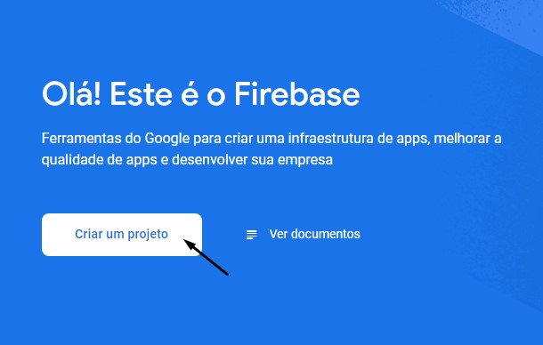

Escolha o nome do seu projeto e clique em continuar 

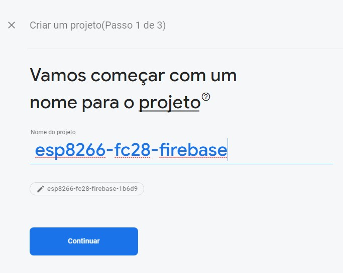

Para as duas telas seguintes você também deverá apertar em continuar. No passo 3/3 você deve escolher a sua Google Analytic para se vincular a esse projeto e finalmente criá-lo.

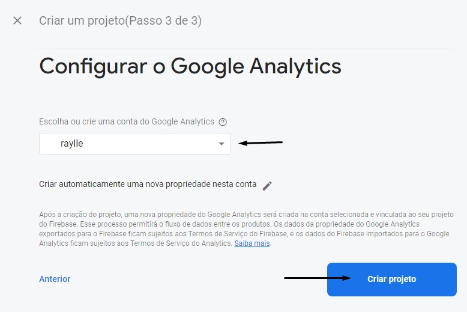

Quando o projeto for criado você pode observar do lado esquerdo a opção "Realtime Database", essa é a funcionalidade que usaremos. 

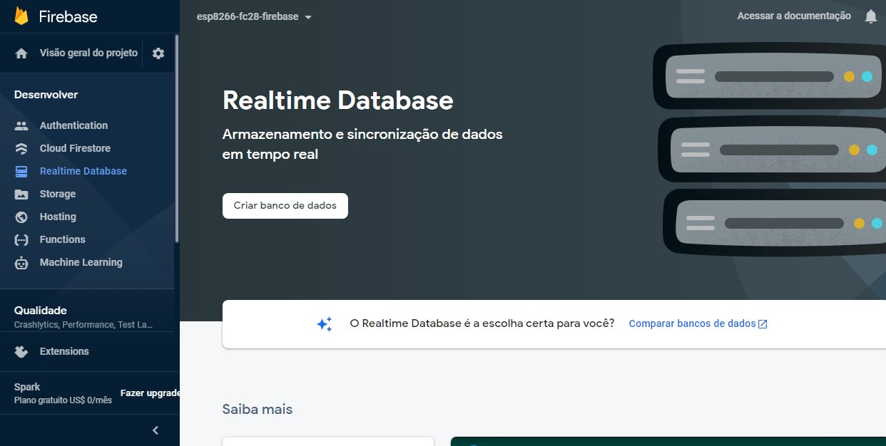

Quando o banco de dados é criado uma caixinha falando sobre as regras de segurança do Realtime Database. Por padrão o modo bloqueado estará marcado, deixe assim mesmo e clique em "Ativar". Com o seu banco criado você terá algo como a tela seguinte:

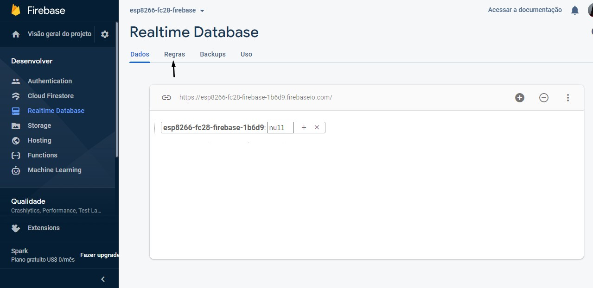

Clicando em "Regras" altere para:

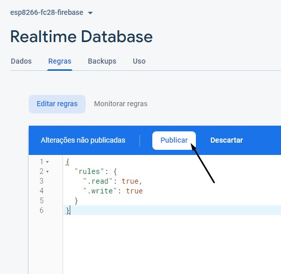

Feito isso, o próximo passo é vincular o nosso aplicativo com o Firebase. Para essa parte devemos ir nas configurações do projeto

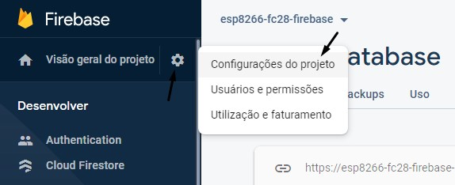

Rolando toda a página podemos ver os aplicativos vinculados a esse peojeto. No caso não há nenhum e devemos clicar na opção de Android, ele irá redirecionar para uma tela de registro do app.

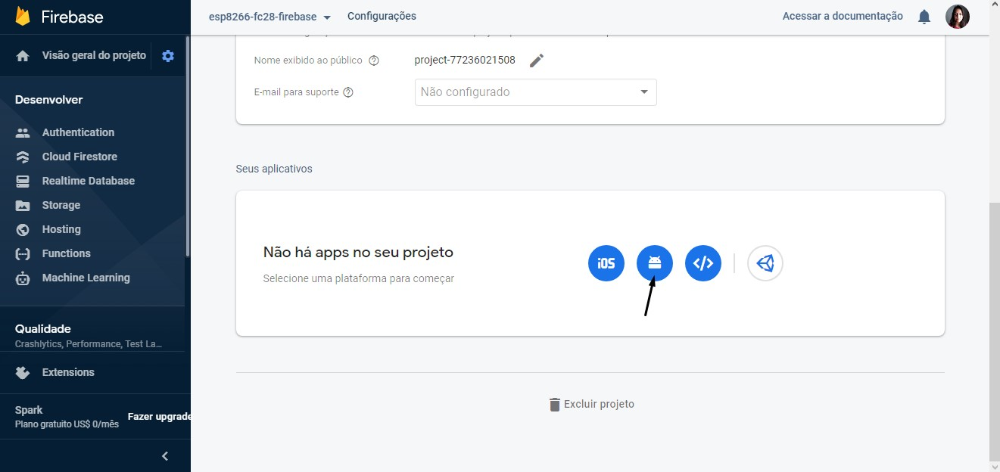
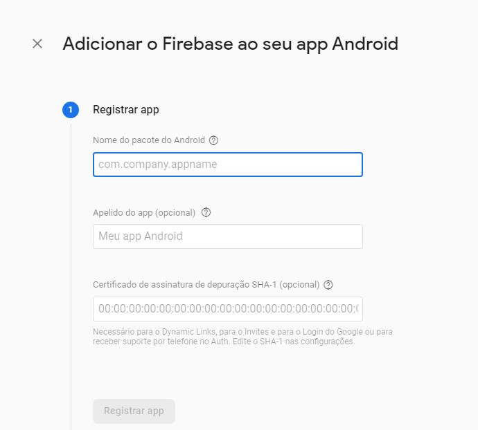


Com isso, devemos agora criar o projeto no Android Studio.

Iremos usar uma empty activity. 
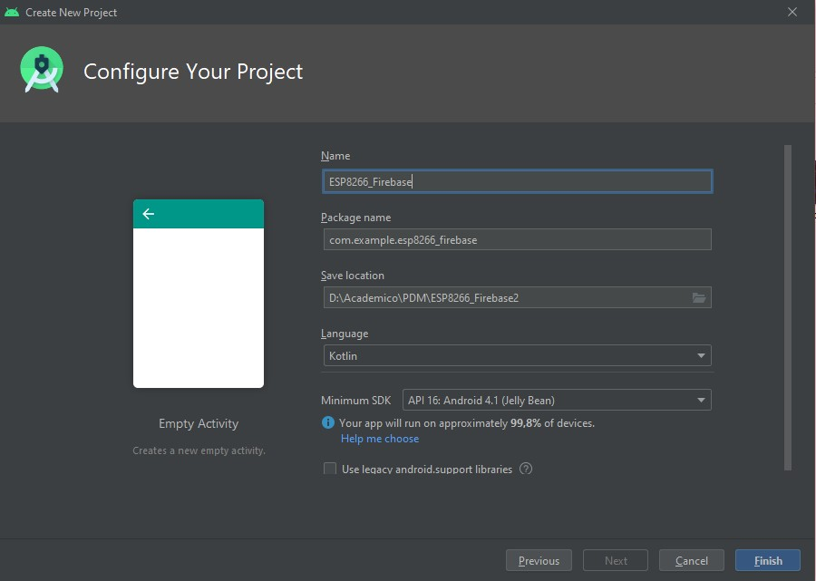

Ao criarmos o projeto teremos o nome do pacote na MainActivity
``` (change)>
package com.example.esp8266_firebase
```
Voltando ao firebase, faça os passos seguintes:
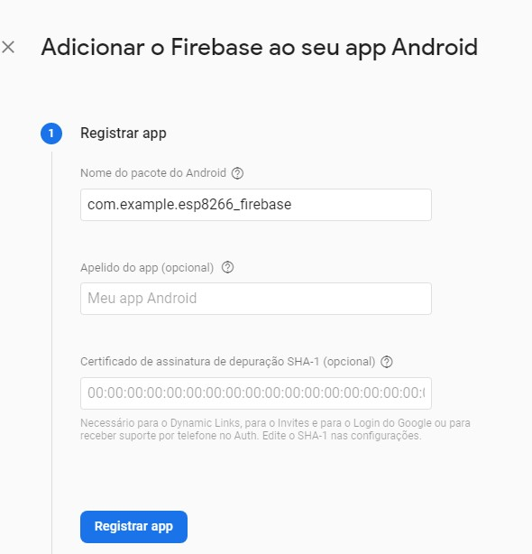
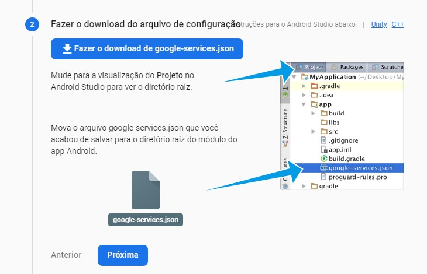
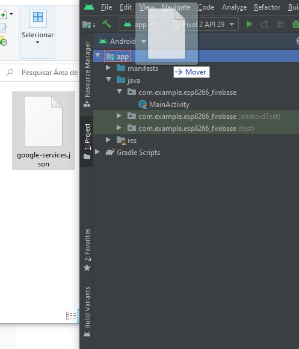

Feito isso, vá para o Android Studio, clique em "Tools" > "Firebase" > "Realtime Firebase" > "Save and retrieve data"

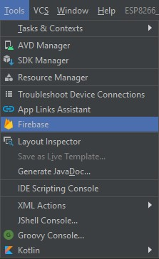
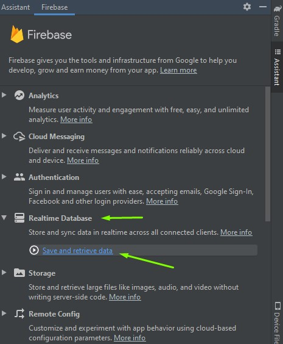

Você deve clicar em "Conect to Firebase" e escolher o projeto que acabou de criar no firebase.
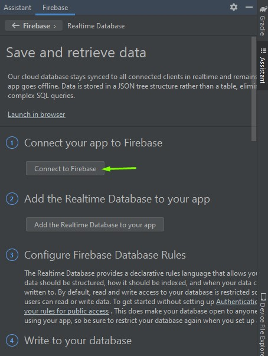
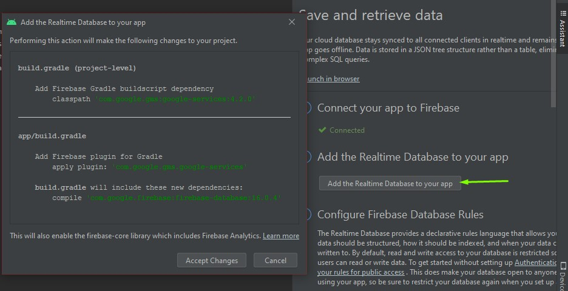


Após isso você deve ter a seguinte tela e o seu aplicativo android já deve estar vinculado ao firebase e podemos começar a construir a nossa aplicação.

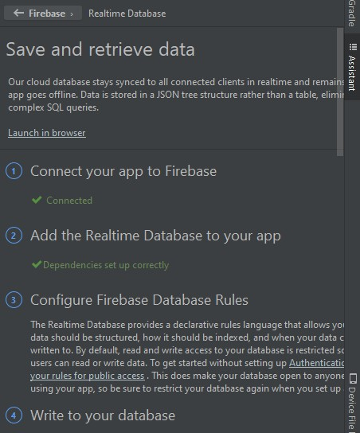


O contexto do aplicativo é que ele exiba o estado do solo de uma planta, através de uma imagem e de um texto. Assim, teremos um Image View para exibir a imagem e um Text View para o texto. Também teremos dois botões na aplicação que acionariam uma bomba d'água (enviando o estado de "on" ou "off" para o firebase). Definimos também uma imagem padrão para ser exibida, caso não haja dados do solo no firebase sendo exibidos na aplicação, o que resulta na tela abaixo:

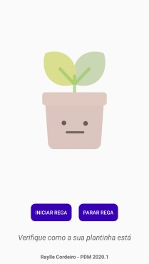

Após isso, na nossa actitivy principal, iremos criar uma variável lateinit para os componentes criados e os resgatar através do método findViewByID:

``` (change):
package com.example.esp8266_firebase

import ...

Class MainActivity : AppCompatActivity() {
    private lateinit var ivImagem: ImageView
    private lateinit var btRegar: Button
    private lateinit var btParar: Button
    private lateinit var tvStatus: TextView

    override fun onCreate(savedInstanceState: Bundle?) {
        super.onCreate(savedInstanceState)
        setContentView(R.layout.activity_main)

          this.ivImagem = findViewById(R.id.ivImagem)
          this.btRegar = findViewById(R.id.btRegar)
          this.btParar = findViewById(R.id.btParar)
          this.tvStatus = findViewById(R.id.tvStatus)
    }     
```


