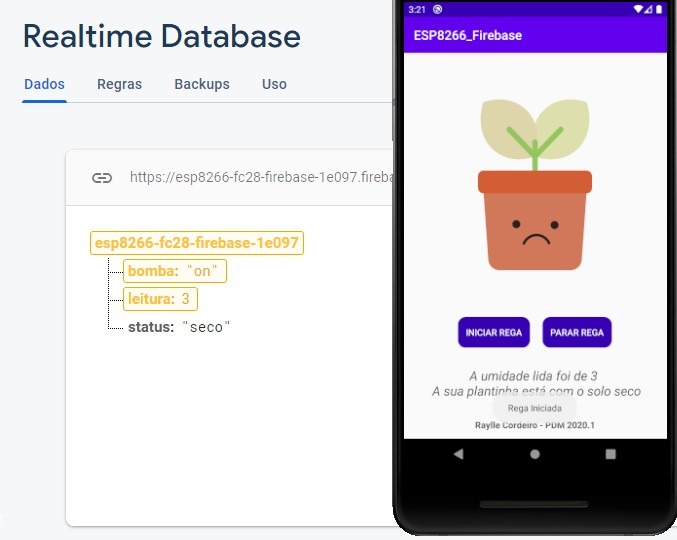
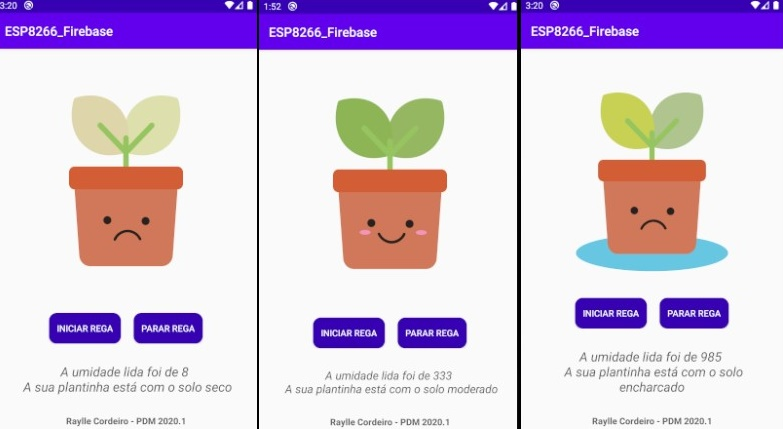

# Projeto PDM - Firebase

Esse projeto consiste em um aplicativo que envia e recebe dados através do [Firebase](https://rockcontent.com/br/blog/firebase/).

O recebimento dos dados pode ser observado através de uma mensagem na tela e imagens. O envio é feito por meio de botões no aplicativo. Desta forma, a primeira coisa a ser feita é entrar no site do Firebase (clicando [aqui](https://firebase.google.com)) e logar na sua conta do Google. Após isso você deverá clicar na opção abaixo:


Escolha o nome do seu projeto e clique em continuar 


Para as duas telas seguintes você também deverá apertar em continuar. No passo 3/3 você deve escolher a sua Google Analytic para se vincular a esse projeto e finalmente criá-lo.


Quando o projeto for criado você pode observar do lado esquerdo a opção "Realtime Database", essa é a funcionalidade que usaremos. 


Quando o banco de dados é criado uma caixinha falando sobre as regras de segurança do Realtime Database. Por padrão o modo bloqueado estará marcado, deixe assim mesmo e clique em "Ativar". Com o seu banco criado você terá algo como a tela seguinte:


Clicando em "Regras" altere para:


Feito isso, o próximo passo é vincular o nosso aplicativo com o Firebase. Para essa parte devemos ir nas configurações do projeto


Rolando toda a página podemos ver os aplicativos vinculados a esse peojeto. No caso não há nenhum e devemos clicar na opção de Android, ele irá redirecionar para uma tela de registro do app.


Com isso, devemos agora criar o projeto no Android Studio.

Iremos usar uma empty activity.


Ao criarmos o projeto teremos o nome do pacote na MainActivity

```package com.example.esp8266_firebase```

Voltando ao firebase, faça os passos seguintes:


Feito isso, vá para o Android Studio, clique em "Tools" > "Firebase" > "Realtime Firebase" > "Save and retrieve data"


Você deve clicar em "Conect to Firebase" e escolher o projeto que acabou de criar no firebase.


Após isso você deve ter a seguinte tela e o seu aplicativo android já deve estar vinculado ao firebase e podemos começar a construir a nossa aplicação.


O contexto do aplicativo é que ele exiba o estado do solo de uma planta, através de uma imagem e de um texto. Assim, teremos um Image View para exibir a imagem e um Text View para o texto. Também teremos dois botões na aplicação que acionariam uma bomba d'água (enviando o estado de "on" ou "off" para o firebase). Definimos também uma imagem padrão para ser exibida, caso não haja dados do solo no firebase sendo exibidos na aplicação, o que resulta na tela abaixo:


Após isso, na nossa actitivy principal, iremos criar uma variável lateinit para os componentes criados e os resgatar através do método findViewByID:

```kotlin
package com.example.esp8266_firebase

import ...

Class MainActivity : AppCompatActivity() {
    private lateinit var ivImagem: ImageView
    private lateinit var btRegar: Button
    private lateinit var btParar: Button
    private lateinit var tvStatus: TextView

    override fun onCreate(savedInstanceState: Bundle?) {
        super.onCreate(savedInstanceState)
        setContentView(R.layout.activity_main)

          this.ivImagem = findViewById(R.id.ivImagem)
          this.btRegar = findViewById(R.id.btRegar)
          this.btParar = findViewById(R.id.btParar)
          this.tvStatus = findViewById(R.id.tvStatus)
    }     
```

Para que possamos inserir os dados no firebase precisamos criar uma instância para isso:

```kotlin
var database = FirebaseDatabase.getInstance().reference
```

Para atribuir um valor em uma posição qualquer do Database basta que façamos o seguinte:

```database.setValue("IFPB")```

Entretanto, para os fins da aplicação teremos os campos "bomba", "leitura" e "status". Como dito anteriormente, iremos enviar o valor de "on" e "off" para o campo "bomba" do firease através do clique do botão, assim: 

```kotlin
 btRegar.setOnClickListener(){
    database.child("bomba").setValue("on")
    Toast.makeText(this,"Rega Iniciada",Toast.LENGTH_SHORT).show()
 }
 
```



```kotlin
 btParar.setOnClickListener(){
    database.child("bomba").setValue("off")
    Toast.makeText(this,"Rega Finalizada",Toast.LENGTH_SHORT).show()
 }

```


Vale salientar que desta maneira o valor que será inserido irá substituir o valor anterior. Se quisermos manter os valores enquanto adicionamos novos, para o mesmo "filho", devemos trabalhar com uma key.

Para ser mais fácil de gerenciar os dados (de leitura e status) iremos criar uma classe para eles. Para isso devemos ir em "File" > "New" > "Kotlin file/ Class" ou criar uma classe interna na nossa Main Activity.

A classe criada foi a seguinte:

```kotlin
package com.example.esp8266_firebase

class Dados {
    var leitura: Int
    var status: String

    constructor(leitura: Int, status: String){
        this.leitura = leitura
        this.status = status
    }
}
```

Para ler os valores do firebase iremos criar instancia para o ValueEventListner, implementenado dois métodos como abaixo:

```kotlin
var getdata = object : ValueEventListener{
            override fun onCancelled(p0: DatabaseError) {
            }

            override fun onDataChange(p0: DataSnapshot) {
                var map = p0.value as Map<String, Any>

                var dados = Dados( map["leitura"].toString().toInt(),  map["status"].toString())

                tvStatus.text = "A umidade lida foi de ${dados.leitura} \n A sua plantinha está com o solo ${dados.status}"

                setImage(dados.status)

            }
        }
```

Usamos o Map para pegarmos uma lista com todas as strings disponíveis e assim podermos exibir os valores de status e leitura (como inteiro).

Após isso é importante usar os métodos addValueEventListener() e addListenerForSingleValueEvent() para ler dados em um caminho e detectar as alterações, assim, adicionando um ValueEventListener ao DatabaseReference. Então ainda na nossa função onCreate iremos adicionar o seguinte código:

```kotlin
database.addValueEventListener(getdata)
database.addListenerForSingleValueEvent(getdata)
```

Como dito antes, o valor do status implicará numa mudança de imagem na aplicação. Para isso, criamos uma função chamada setImage que obedece as seguintes condições:

```kotlin
fun setImage( status : String){
        val img = ivImagem
        when(status){
            "seco" -> img.setImageResource(R.drawable.ic_img1)
            "moderado" -> img.setImageResource(R.drawable.ic_img2)
            "encharcado" -> img.setImageResource(R.drawable.ic_img3)
            else -> img.setImageResource(R.drawable.ic_img4)
        }
    }
```
Assim, as nossas possíveis telas são:


